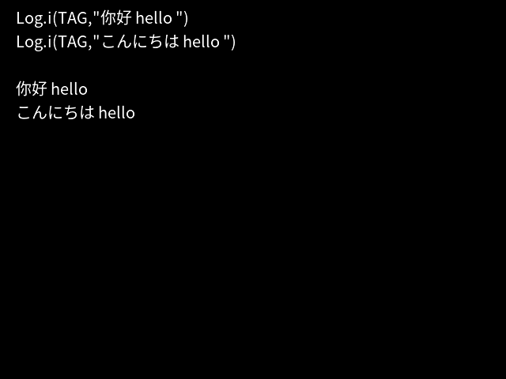

A text overlay library based on freetype2 for android, support overlay unicode text on YUV image frame.

currently supported abi: arm64-v8a,armeabi-v7a, x86



usage:


```kotlin
// create TextDraw instance
val draw = TextDraw()
// init with font path, text size, rotation angle:
draw.init("/system/fonts/NotoSansCJK-Regular.ttc",20,0.0f)
// draw text on a frame, at position[20,120]
draw.draw("你好 hello ", 20, 120, frame, width, height)
// release the instance
draw.release()
```

compile
--------
### compile freetype
- `cd freetype-2.11.1`
- edit build_android.sh, set `NDK_PATH` and `HOST_PLATFORM` to your ndk path and host.
- `sh ./build_android.sh`

### compile textdraw
- `cd android/library/freetype_jni`
- `ndk-build`

test
--------
- Run the test case on Android device:

    `android/library/src/androidTest/java/com/tsinglink/android/library/TextDrawTest.kt`
License
-------

    Copyright 2022 Tsinglink

    Licensed under the Apache License, Version 2.0 (the "License");
    you may not use this file except in compliance with the License.
    You may obtain a copy of the License at

       http://www.apache.org/licenses/LICENSE-2.0

    Unless required by applicable law or agreed to in writing, software
    distributed under the License is distributed on an "AS IS" BASIS,
    WITHOUT WARRANTIES OR CONDITIONS OF ANY KIND, either express or implied.
    See the License for the specific language governing permissions and
    limitations under the License.